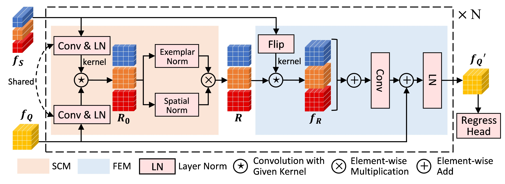

# SAFECount
Official PyTorch Implementation of [Few-shot Object Counting with Similarity-Aware Feature Enhancement](https://arxiv.org/abs/2201.08959), Accepted by WACV 2023.




## 1. Quick Start

### 1.1 FSC147 in Original Setting 

- **Create the FSC147 dataset directory**. Download the FSC147 dataset from [here](https://github.com/cvlab-stonybrook/LearningToCountEverything). Unzip the file and move some to `./data/FSC147_384_V2/`. The FSC147 dataset directory should be as follows. 

```
|-- data
    |-- FSC147_384_V2
        |-- images_384_VarV2
        |-- gt_density_map_adaptive_384_VarV2
        |-- train.json
        |-- val.json
        |-- test.json
        |-- fold0.json
        |-- fold1.json
        |-- fold2.json
        |-- fold3.json
```

- **cd the experiment directory** by running `cd ./experiments/FSC147/`. 

- **Train, eval, or test** by running: 

    (1) For slurm group:  `sh train.sh #NUM_GPUS #PARTITION`, `sh eval.sh #NUM_GPUS #PARTITION`, or `sh test.sh #NUM_GPUS #PARTITION`.

    (2) For torch.distributed.launch: `sh train_torch.sh #NUM_GPUS #GPU_IDS`, `sh eval_torch.sh #NUM_GPUS #GPU_IDS`, or `sh test_torch.sh #NUM_GPUS #GPU_IDS`, *e.g.*, train with GPU 1,3,4,6 (4 GPU in total): `sh train_torch.sh 4 1,3,4,6`.

    **Note**: During eval or test, please *set config.saver.load_path* to load the checkpoints. 

- **Results and checkpoints**. Training on 8 GPUs (NVIDIA Tesla V100 16GB) results in following performance.

| Val MAE | Val RMSE | Test MAE | Test RMSE | Checkpoints |
| ------ | ------ | ------ | ------ | ------ |
|  14.42 | 51.72 | 13.56 | 91.30 | [here](https://drive.google.com/file/d/1mbV0xJdORIpSLlMCwlgENMB9Y1kUOhk2/view?usp=sharing) |

### 1.2 FSC147 in Cross Validation Setting 

**Note**: here we provide one example (3 shot, fold0 as val set), and the others are similar. 

- **Create the FSC147 dataset directory**, the same as in **1.1**. 

- **cd the experiment directory** by running `cd experiments/FSC147_fold/3shot/fold0/`. 

- **Train or eval** by running:

    (1) For slurm group: `sh train.sh #NUM_GPUS #PARTITION` or `sh eval.sh #NUM_GPUS #PARTITION`. 
    
    (2) For torch.distributed.launch: `sh train_torch.sh #NUM_GPUS #GPU_IDS` or `sh eval_torch.sh #NUM_GPUS #GPU_IDS`. 
    
    **Note**: During eval or test, please *set config.saver.load_path* to load the checkpoints. 

- **Results and checkpoints**. Training on 8 GPUs (NVIDIA Tesla V100 16GB) results in following performance. 

| Shot | Val Fold | Val MAE | Val RMSE | | Shot | Val Fold | Val MAE | Val RMSE |
| ------ | ------ | ------ | ------ | ------ | ------ | ------ | ------ | ------ |
|  1 | 0 | 15.62 | 51.20 | |  3 | 0 | 13.84 | 43.99 |
|  1 | 1 | 7.14  | 15.77 | |  3 | 1 | 6.29  | 13.89 |
|  1 | 2 | 14.05 | 92.48 | |  3 | 2 | 11.19 | 86.81 |
|  1 | 3 | 13.88 | 38.38 | |  3 | 3 | 11.73 | 33.85 |


### 1.3 Class-specific Counting

The train and eval of class-specific counting are similar to FSC147. Here we only provide **the construction of the dataset directory**. The checkpoints (trained on 8 NVIDIA Tesla V100 16GB GPUs) and the corresponding results are given. 

|        | CARPK | PUCPR+ | UCSD | Mall | ShanghaiTech PartA | ShanghaiTech PartB | 
| ------ | ------ | ------ | ------ | ------ | ------ | ------ |
|     MAE     | 4.91 | 2.24 | 1.01 | 1.77 | 74.36 | 9.75 |
|     RMSE    | 6.32 | 3.44 | 1.34 | 2.24 | 121.15 | 15.87 |
| checkpoints | [here](https://drive.google.com/file/d/1fp2BLG5WPNqiiM91k6kwescfLY-ZNA_T/view?usp=sharing) | [here](https://drive.google.com/file/d/12J635jZI4SXUKBBPcuwdOJrBdeC_6d_U/view?usp=sharing) | [here](https://drive.google.com/file/d/1IVjLdnJ9IgiyfvM2sDK42k_9l416aprv/view?usp=sharing) | [here](https://drive.google.com/file/d/1oUKJqbhB5GFKLtXuzshNJ7qL6npE3e3f/view?usp=sharing) | [here](https://drive.google.com/file/d/1y3VgGNsQbGB5sPN98_nlOxisQ1ebnFbx/view?usp=sharing) | [here](https://drive.google.com/file/d/1DqrUHK3hgsVfLwxNAWiYgYtORMpKoYxb/view?usp=sharing) |

**1) CARPK**

- Download the CARPK dataset from [here](https://lafi.github.io/LPN/). Unzip the file and move some to `./data/CARPK_devkit/`. The CARPK dataset directory should be as follows. 
```
|-- data
    |-- CARPK_devkit
        |-- Images
        |-- gen_gt_density.py
        |-- train.json
        |-- test.json
        |-- exemplar.json
```
- run `python gen_gt_density.py` to generate ground-truth density map. The ground-truth density map will be saved to `./data/CARPK_devkit/gt_density_map/`. 

**2) PUCPR+**

- Download the PUCPR+ dataset from [here](https://lafi.github.io/LPN/). Unzip the file and move some to `./data/PUCPR+_devkit/`. The PUCPR+ dataset directory should be as follows. 
```
|-- data
    |-- PUCPR+_devkit
        |-- Images
        |-- gen_gt_density.py
        |-- train.json
        |-- test.json
        |-- exemplar.json
```
- run `python gen_gt_density.py` to generate ground-truth density map. The ground-truth density map will be saved to `./data/PUCPR+_devkit/gt_density_map/`. 

**3) UCSD**

- Download the UCSD dataset from [here](http://www.svcl.ucsd.edu/projects/peoplecnt/). Unzip the file and move some to `./data/UCSD/`. The UCSD dataset directory should be as follows. 
```
|-- data
    |-- UCSD
        |-- ucsdpeds_vidf
        |-- gen_gt_density.py
        |-- train.json
        |-- test.json
        |-- exemplar.json
        |-- mask.png
```

- We use the annotations in `vidf-cvpr.zip`, which corresponds to 10 directories (from `ucsdpeds_vidf/video/vidf/vidf1_33_000.y/` to `ucsdpeds_vidf/video/vidf/vidf1_33_009.y/`). Merge all images under these 10 directories to `ucsdpeds_vidf/video/vidf/`. Other directories could be removed. 

- run `python gen_gt_density.py` to generate ground-truth density map. The ground-truth density map will be saved to `./data/UCSD/gt_density_map/`. 

**4) Mall**

- Download the Mall dataset from [here](http://personal.ie.cuhk.edu.hk/~ccloy/downloads_mall_dataset.html). Unzip the file and move some to `./data/Mall/`. The Mall dataset directory should be as follows. 
```
|-- data
    |-- Mall
        |-- frames
        |-- gen_gt_density.py
        |-- train.json
        |-- test.json
        |-- exemplar.json
        |-- mask.png
```
- run `python gen_gt_density.py` to generate ground-truth density map. The ground-truth density map will be saved to `./data/Mall/gt_density_map/`. 

**5) ShanghaiTech**
- Download the ShanghaiTech dataset from [here](https://github.com/desenzhou/ShanghaiTechDataset). Unzip the file and move some to `./data/ShanghaiTech/`. The ShanghaiTech dataset directory should be as follows. 
```
|-- data
    |-- ShanghaiTech
        |-- part_A
            |-- train_data
                |-- images
            |-- test_data
                |-- images
            |-- gen_gt_density.py
            |-- train.json
            |-- test.json
            |-- exemplar.json
        |-- part_B
            |-- train_data
                |-- images
            |-- test_data
                |-- images
            |-- gen_gt_density.py
            |-- train.json
            |-- test.json
            |-- exemplar.json
```

- run `python gen_gt_density.py` to generate ground-truth density map. Note that you should run this **twice** for both part_A and part_B. The ground-truth density map will be saved to (1) `./data/ShanghaiTech/part_A/train_data/gt_density_map/`, (2) `./data/ShanghaiTech/part_A/test_data/gt_density_map/`, (3) `./data/ShanghaiTech/part_B/train_data/gt_density_map/`, (4) `./data/ShanghaiTech/part_B/test_data/gt_density_map/`. 

## 2. Learn More About Our Methods

- We provide two datasets: *custom_dataset.py* & *custom_exemplar_dataset.py*, and two models: *safecount.py* & *safecount_exemplar.py*. They should be cooperated and used as follows. 

| dataset | model | circumstance |
| ------ | ------ | ------ |
| *custom_dataset.py* | *safecount.py* | The *support images* are parts of the *query image*, and annotated by bounding boxes, *e.g.*, FSC147. |
| *custom_exemplar_dataset.py* | *safecount_exemplar.py* | The *support images* are sampled then fixed, and not parts of the *query image*, *e.g.*, CARPK, PUCPR+, UCSD, Mall, and ShanghaiTech. |
